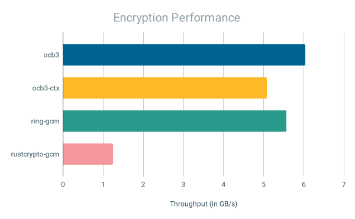
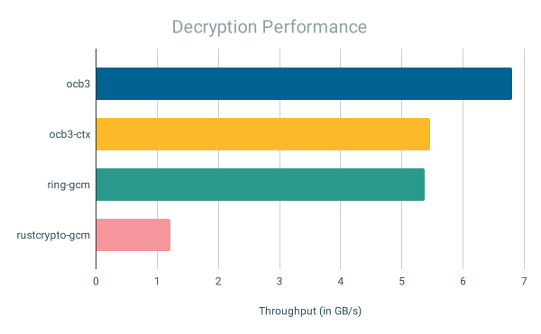

# `offset-cookbook-mode`: Experimental OCB3 and CTX\<OCB3\>

[](https://github.com/sgmenda/offset-cookbook-mode/actions/workflows/rust.yml)

Rust implementation of `AES128-OCB3`, specified in [RFC 7253](https://datatracker.ietf.org/doc/rfc7253/), with a 128-bit tag and 96-bit nonce; and `CTX<AES128-OCB3>`, where `CTX` is specified in [Chan and Rogaway (2022)](https://eprint.iacr.org/2022/1260) and instantiated using `Blake2s256`.

### ⚠️ Security (Or Lack Thereof)

_This crate is experimental and may provide less-than-expected security, please do not use it in practice._

### Features

- Implements RustCrypto [`aead`](https://docs.rs/aead/) traits.
- `#![no_std]`.

### Usage

```rust
use offset_cookbook_mode::ocb3_ctx::aead::{AeadInPlace, KeyInit};
use offset_cookbook_mode::ocb3_ctx::{Aes128Ocb3Ctx, Key, Nonce};

let key = Key::from_slice(b"YELLOW SUBMARINE");
let cipher = Aes128Ocb3Ctx::new(&key);

let ad = [0u8; 16];
let nonce = Nonce::from_slice(b"WATER!CRAFT!");

let mut buffer = vec![0u8; 4096];

// encrypt buffer in-place
let tag = cipher
    .encrypt_in_place_detached(&nonce, &ad, &mut buffer)
    .expect("encryption failed");
assert_ne!(buffer, vec![0u8; 4096]);

// decrypt buffer in-place
cipher
    .decrypt_in_place_detached(&nonce, &ad, &mut buffer, &tag)
    .expect("decryption failed");
assert_eq!(buffer, vec![0u8; 4096]);
```

### Benchmarks

Performance on AWS [`m6i.metal`](https://aws.amazon.com/ec2/instance-types/m6i/) with 4kb input and 16 byte associated data, run with `-Ctarget-cpu=native`, and comparing with [Ring's](https://github.com/briansmith/ring) AES128-GCM and [RustCrypto's](https://github.com/RustCrypto/AEADs/tree/master/aes-gcm) AES128-GCM.

<p align="center">

</p>

<p align="center">

</p>

---

#### License

This crate is licensed under either [Apache License 2.0](./LICENSE-Apache) or [MIT License](./LICENSE-MIT).
